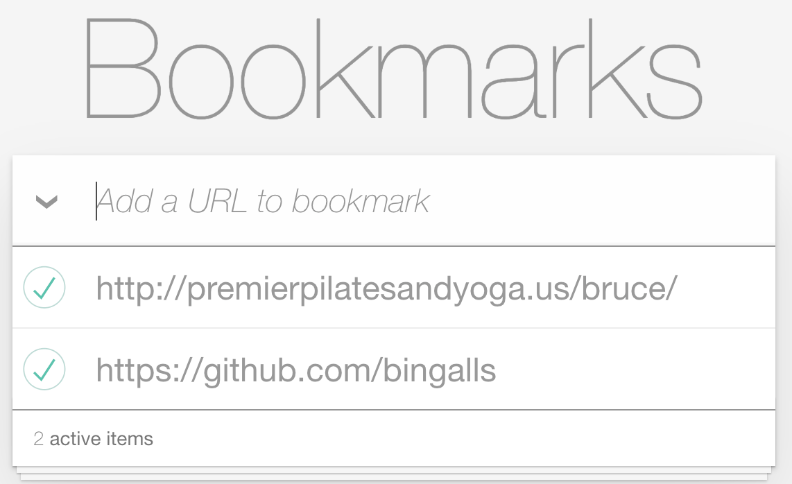

# Bookmark
List URLs with laravel and vue.js



# Requirements
* PHP >= 7.2 , < 8
* Node >= 12

Runs on Laravel and Vue

# Install
Tested on recent MacOS; should work on Linux compatible systems.
```bash
cp .env.example .env  # 'copy' on Windows
composer install
php artisan key:generate
# yarn
yarn install
yarn run dev
# or npm
npm install
npm run dev
```

# Optional Configuration
This demo ships with a sqlite database.
Configure .env to taste
```bash
php artisan migrate
php artisan db:seed
```
